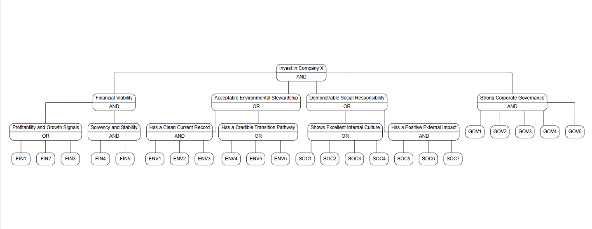

# Summary

`andorR`  (pronounced ‘Andorra’) is an R package to optimize the use of resources in the completion of an expert system AND-OR decision tree, in the face of uncertainty. Expert system AND-OR decision trees consist of a list of questions (leaves) connected by a hierarchical set of decision nodes, each using AND or OR logic to reach a conclusion (the outcome of the root node). 

`andorR` provides a function to help select most strategic sequence of questions to reach a conclusion with the minimum number of questions. By capturing the level of confidence in each response, it can  provide guidance on the prioritisation of new evidence generation to best increase confidence in the conclusion. The package also includes an iterative interface to automate the process completing the decision tree. 

# Statement of need

AND-OR decision trees (also known as logic trees or Boolean decision trees) provide a structured way to implement expert systems in domains where repeatable, transparent, and standardized decision processes are critical, and where multiple pathways may lead to the same conclusion [@usnrc1981fault; @iec61025]. Such trees are particularly valuable when decisions are based on a set of binary (TRUE/FALSE) criteria that can be combined using AND and OR logic.  

Examples include **clinical diagnosis of complex or ambiguous diseases**, where diagnostic rules break down symptoms, signs, and lab findings into yes/no criteria that guide treatment decisions. Well-known examples are the *Ottawa Ankle Rules* for imaging in acute ankle injuries [@stiell1992ottawa; @stiell1994implementation], the *Centor criteria* for streptococcal pharyngitis [@centor1981diagnosis], and the *Alvarado score* for suspected appendicitis [@alvarado1986score]. In these cases, individual binary criteria are combined sequentially to arrive at a single diagnostic or management decision.  

Similarly, AND-OR decision trees are used to support **transparent policy decisions**, such as determining whether to add an item to a regulated list. The World Organisation for Animal Health (WOAH) uses a set of criteria, each evaluated as TRUE/FALSE, which are combined via logical operations to produce a decision on listing notifiable animal diseases [@woah2024code; @woahCriteria]. The United Nations Educational, Scientific and Cultural Organization uses a similar approach to selecting world heritage sites [@unesco2023operational; @unescoCriteria] 

In **finance and investment management**, stage-gate systems and exclusionary screening provide additional examples of AND-OR decision trees. Companies make Go/No-Go investment decisions by evaluating multiple criteria, often combined via AND/OR logic, and sometimes incorporating confidence or scoring thresholds at each decision gate [@cooper1990stagegate; @cooper2002optimizing; @trinks2017opportunity]. For instance, socially responsible investment screening often applies a set of binary inclusion/exclusion criteria to determine portfolio eligibility [@dimson2020exclusion].  

In each case, the decision process can be represented as a tree, where nodes apply AND/OR logic to the results of individual criteria, leading to a single binary outcome at the root. This representation provides transparency, reproducibility, and the ability to explicitly track confidence or uncertainty at each decision point [@mcgee2002simplifying; @grimes2005refining]. An example of a hypothetical decision tree to guide ethical investments is shown below:



While the size of such trees is usually relatively small (less than 40 or 50 individual questions or leaves), determining an accurate answer to each question may require considerable resources. For example, a diagnostic expert system may include a variety of tests and investigations, some of which may be expensive or invasive. When making a policy decision, such as adding a disease an officially notifiable list, detailed information about the distribution, transmissibility and potential impact of the disease is required. Detailed surveillance or research studies may be required to gather this information. 

Except in the trivial case of a single AND node (in which case the decision tree is simply a check list), reaching a conclusion usually does not require all questions to be answered, and the number of questions required depends both on the response to specific questions and the order in which they are completed. Minimising the number of questions that need to be answered can result in significant savings, but the users of such expert systems may find it difficult, in the face of complex branching logic, to choose the optimal sequence. 

At the same time, absolute certainty is not always necessary. By assigning a confidence level to each response, it is possible to calculate the overall confidence in the conclusion. A few low confidence inputs may still result in adequately high confidence response. 

In practice, those using this type of expert system may often do a ‘first draft’ providing low confidence responses to generate an initial conclusion. This is followed by research to generate evidence to increase the confidence of the more influential questions, thereby increasing confidence in the conclusion until a target threshold is reached. 

While the R ecosystem has excellent packages for machine-learning-derived decision trees (e.g., `rpart`), there is a lack of tools specifically designed for the interactive, evidence-gathering workflow of expert-defined logic trees. `andorR` addresses this need by providing functions to:

1. Optimize the path to a conclusion: It calculates the influence of each unanswered question, guiding the user to the most efficient sequence.
2. Manage uncertainty: It propagates semi-quantitative confidence scores through the tree's logic.
3. Guide confidence-building: It identifies which low-confidence answers are the most critical to strengthen through further investigation.

# Usage

## Installation and loading

This package can be installed from GitHub.

In order to install `andorR` use the following command:

```r
if(!require("devtools")) {
  install.packages("devtools")
}
devtools::install_github("epimundi/andorR")
```

Load the package by typing


```r
library(andorR)
```
## Tree analysis

### Decision tree definition formats

Three formats can be used to define a decision tree: relational, hierarchical, 
and path-string. These are explained in the vignette [Data Formats for andorR](https://EpiMundi.github.io/andorR/articles/data-formats.html) 
and [examples](https://EpiMundi.github.io/andorR/articles/example-data-files.html) are provided.

### Loading and analysing a decision tree

A family of ``load_tree_`` functions load data from file or memory. The ``update_tree()`` function propagates results up the tree, and performs optimisation calculations based on responses provided.

### Determining the most influential questions

The ``get_highest_influence()`` function returns an ordered list of questions (leaves) that
have the greatest impact on resolving the tree. The algorithm is described in the
vignette on the [Optimisation of AND-OR Decision Trees](https://EpiMundi.github.io/andorR/articles/tree-optimisation.html)

### Improving confidence in the conclusion

The ``get_confidence_boosters()`` function performs a sensitivity analysis to determine
which questions would have the greatest impact on the overall tree confidence if
more evidence was generated to improve the confidence in the individual response.
the approach is described in the [Confidence Boosting and Sensitivity Analysis](https://EpiMundi.github.io/andorR/articles/confidence-boosting.html)
vignette.

### Interactive use

The ``andorR_interactive()`` function launches a command-line interactive tool to
iteratively priotise questions, capture the response, recalculate the tree and
propose an updated list of priority questions. After the tree has been resolved
it switches to confidence boosting mode. The overall process is described in the
[Introduction to andorR](https://EpiMundi.github.io/andorR/articles/andorR-intro.html) vignette.

The package also contains helper functions to read and display the current
state of decision trees during analysis.


# References


