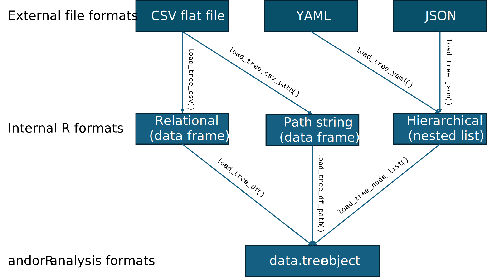

```{r, setup, include = FALSE}
knitr::opts_chunk$set(
  collapse = TRUE,
  comment = "#>"
)
library(andorR)
```

The `andorR` package is designed to be flexible, allowing you to define your decision tree structure in several different formats depending on your preference and source data. This guide explains the three primary formats and the functions used to load them.

The examples below use the `ethical` investment decision tree, which is included as a dataset within this package.

## 1. The Hierarchical Format (YAML or JSON)

This is often the most intuitive and human-readable format, as its indented structure visually represents the tree's hierarchy. It is highly recommended for creating and managing trees in a text editor.

**Required Fields:**

* `name`: The name of the node.
* `nodes`: A list of child nodes (this key is used instead of the reserved word `children`).
* `rule` : Required for parent nodes, can be **AND** or **OR**
* `question` : Required for leaf nodes

### YAML format

An excerpt from a YAML file (`ethical.yml`) looks like this:

```yaml
name: Invest in Company X
rule: AND
nodes:
  - name: Financial Viability
    rule: AND
    nodes:
      - name: Profitability and Growth Signals
        rule: OR
        question: "Is the company showing strong signs of profitability?"
        nodes:
          - name: FIN1
            question: "Company demonstrates consistent, high revenue growth."
# ... and so on
```

To load a tree from a YAML file, use the `load_tree_yaml()` function.

```{r, eval=FALSE}
# This code shows how to load a YAML file from the package's example data
yaml_path <- system.file("extdata", "ethical.yml", package = "andorR")
tree_from_yaml <- load_tree_yaml(yaml_path)

# View the loaded tree
print(tree_from_yaml)
```

### JSON format

An excerpt from a JSON file (`ethical.json`) looks like this:

```json
{
  "name": "Invest in Company X",
  "rule": "AND",
  "nodes": [
    {
      "name": "Financial Viability",
      "rule": "AND",
      "nodes": [
        {
          "name": "Profitability and Growth Signals",
          "rule": "OR",
          "question": "Is the company showing strong signs of profitability?",
          "nodes": [
            {
              "name": "FIN1",
              "question": "Company demonstrates consistent, high revenue growth."
            },
# ... and so on
```

To load a tree from a JSON file, use the `load_tree_json()` function.

```{r, eval=FALSE}
# This code shows how to load a JSON file from the package's example data
json_path <- system.file("extdata", "ethical.json", package = "andorR")
tree_from_json <- load_tree_json(json_path)

# View the loaded tree
print(tree_from_json)
```

## 2. The Relational (ID/Parent) Format

This is a flat, tabular format common in spreadsheets and databases. The tree structure is defined by a `parent` column that contains the `id` of its parent node. This is also the format of the `ethical` dataset included in the package.

**Required Fields:**

* `id`: A unique numeric ID for every node. The root must have `id = 0`.
* `name`: The name/code for the node.
* `parent`: The `id` of the parent node. The root's parent should be `NA`.
* `rule` : Required for parent nodes, can be **AND** or **OR**
* `question` : Required for leaf nodes

The first few rows of the `ethical` dataset look like this:

```{r, echo=FALSE}
# Load the built-in ethical dataset to display its structure
data(ethical)
knitr::kable(head(ethical, n=10), caption = "Example of the Relational (ID/Parent) Format")
```

To load this format, you can use `load_tree_df()` if you already have a data frame, or `load_tree_csv()` to read it from a `.csv` file.

```{r}
# Load the example 'ethical' data frame that comes with the package
data(ethical)

# Build the tree from the data frame object
tree_from_df <- load_tree_df(ethical)

# The structure is identical to the one loaded from YAML
print(tree_from_df$children[[1]]$name) # Prints "Financial Viability"
```

## 3. The Path String Format

This is another flat-file format that is very robust. The hierarchy is defined by a single `path` column that contains the full, delimited path from the root to each node.

**Required Fields:**

* `path`: A string with a character (like `/`) separating the names of the nodes in the hierarchy.
* `question`: Required for leaves, NA for parent nodes. 
* `rule`: Required for parent nodes, NA for leaves.

An excerpt from a CSV file in this format would look like this:

```{r, echo=FALSE}
# Create a small example of the path string format for display
path_example_df <- data.frame(
  path = c(
    "Invest in Company X",
    "Invest in Company X/Financial Viability",
    "Invest in Company X/Financial Viability/Profitability and Growth Signals",
    "Invest in Company X/Financial Viability/Profitability and Growth Signals/FIN1"
  ),
  rule = c("AND", "AND", "OR", NA)
)
knitr::kable(path_example_df, caption = "Example of the Path String Format")
```

To load this format from a CSV file, use the `load_tree_csv_path()` function.

```{r, eval=FALSE}
# This code shows how to load a path string CSV from the package's example data
path_csv_path <- system.file("extdata", "ethical_tree_path.csv", package = "andorR")
tree_from_path <- load_tree_csv_path(path_csv_path)

print(tree_from_path)
```

### Summary of Formats




| Format Name | Best For | Key Structure | Core Loading Function |
| :--- | :--- | :--- | :--- |
| **Hierarchical** | Manual creation, readability, version control (git) | Indented YAML or JSON file with a `nodes` key | `load_tree_yaml()` or `load_tree_json()` |
| **Relational** | Exporting from databases, spreadsheets (Excel) | A flat table with `id` and `parent` columns | `load_tree_csv()` |
| **Path String** | Programmatic generation, ensuring structural integrity | A flat table with a single `path` column | `load_tree_csv_path()` |

